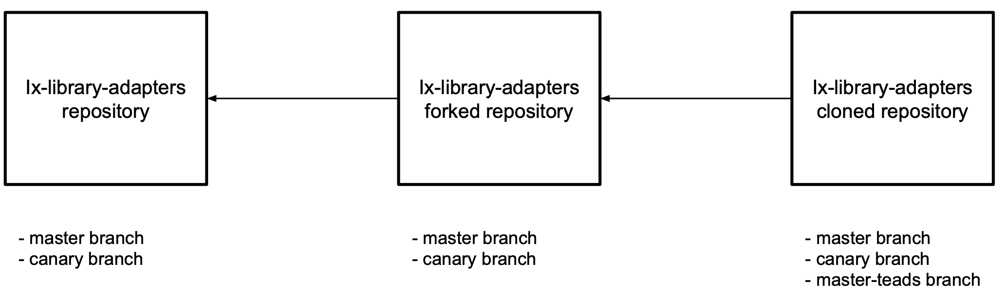

# Table of Contents
1. [Introduction](#intro)
2. [Initial Setup](#initial-setup)
3. [Modifying specific code contained in master-teads](#dev-ci-setup)
4. [Development linked to Teads adapter](#dev-setup)

# <a name='intro'></a>Introduction

<b>Welcome to the repository containing the Teads version of the Index Exchange adapter!</b>

This repository is used for the development of the Teads adapter and is a clone of the fork: https://github.com/ebuzzing/ix-library-adapters of the public `ix-library-adapters` repository: https://github.com/indexexchange/ix-library-adapters

We needed this specific setup as we do not want to develop our adapter in the open

The layout is as follow:



There are three branches in this repository:
* `master` - This branch is a mirror of the fork/public `ix-library-adapters` repositories and thus, should only have the same exact history. No PRs should be merged on this branch from this repository. Only merge from these repositories can be done in order to be up to date. The initial development of an adapter is done on this branch.
* `canary` - This branch is a mirror of the fork/public `ix-library-adapters` repositories and thus, should only have the same exact history. No PRs should be merged on this branch from this repository. Only merge from these repositories can be done in order to be up to date. All update of the Teads adapter are done on top of this branch
* `master-teads` - The branch used for development linked to Teads adapter. It will contains all the specific code used for the development (such as CI configuration, ...), thus is diverging from master.

# <a name='initial-setup'></a>Initial Setup
To be able to develop, follow these steps:
1. Clone the repository
2. In the root directory of the repository, run `npm install`

This will install all the dependencies and tools provided by Index Exchange to help with the adapter development process.

To get a grasp of the layout and tools provided by Index, the [documentation](./README-INDEX.md) they are providing is a must read


# <a name='dev-ci-setup'></a>Modifying specific code contained in master-teads

PRs have to be opened based on `master-teads` and can be merged on it.

# <a name='dev-setup'></a>Development linked to Teads adapter

PRs have to be opened based on `master-teads` in order to take advantages of the CI, etc...

All the code linked to the adapter is in the `teads` folder.

Do not forget to update the [docummentation](./teads/DOCUMENTATION.md) and/or the [changes]()

Once everything is green and the PR is approved, the branch should be moved and based on `canary` in order to open it on the public `ix-library-adapters` repository: https://github.com/indexexchange/ix-library-adapters

- Code Submission Guidelines for the Index Exchange repository

Follow the steps [here](https://knowledgebase.indexexchange.com/display/ADAPTER/Adapter+Code+Submission+Guidelines) to submit your code for review to Index Exchange.

- Linting

All code must pass the linting before it is submitted for review via `npm run lint`

- Debugging

To walk through your bidder code and debug, follow the instructions [here](https://knowledgebase.indexexchange.com/display/ADAPTER/Adapter+Debugger).

- Testing

In order to launch the tests, run `npm run debug` and then follow the instructions:

```
To run the system tests, go to either:

    HTTP:  http://localhost:5837/public/tester/system-tester.html
    HTTPS: https://localhost:5838/public/tester/system-tester.html
```
